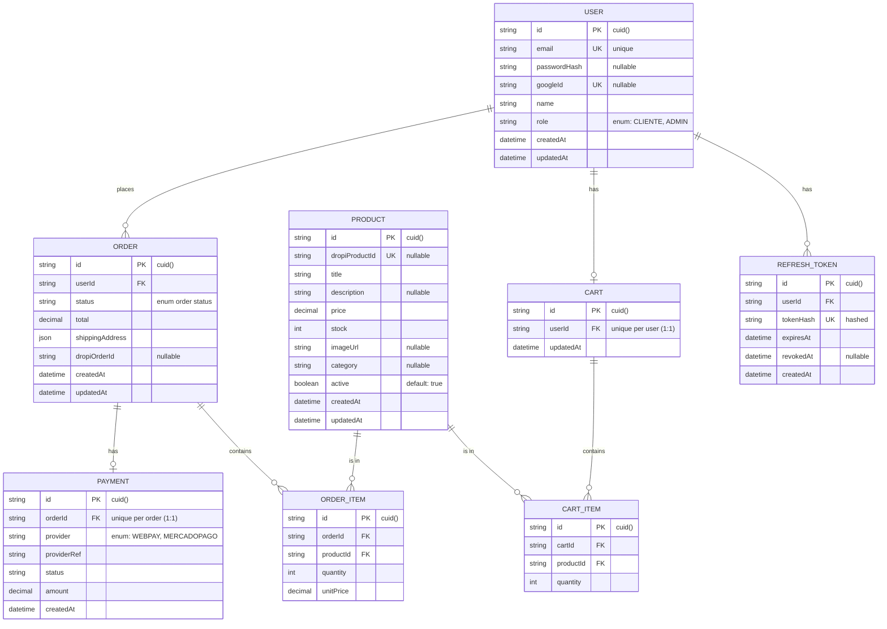

# E-commerce Dropshipping (NestJS / Next.js)

Proyecto E-commerce nativo construido desde cero para demostrar dominio de lógica de negocio compleja, integraciones reales y stack TypeScript moderno.

La filosofía del proyecto es no usar frameworks de e-commerce prearmados. El carrito, checkout, pagos, pedidos y sincronización con dropshipping se implementan como primitivas propias sobre NestJS.

---

## 🛠 Stack Tecnológico

| Capa                 | Tecnología                               |
| -------------------- | ---------------------------------------- |
| Backend              | NestJS 11.x                              |
| Lenguaje             | TypeScript                               |
| ORM                  | Prisma 7.10.0                            |
| Base de datos local  | PostgreSQL 16 con Docker                 |
| Base de datos remota | Neon (pendiente de configurar en deploy) |
| Frontend             | Next.js 15 App Router                    |
| Estilos              | Tailwind CSS                             |
| Package manager      | pnpm workspaces                          |
| Testing              | Jest + Supertest                         |
| Infra local          | Docker Compose                           |

---

## 📁 Estructura del Repositorio

Este proyecto usa un monorepo con `pnpm workspaces`.

```bash
ecommerce-dropshipping/
├── apps/
│   ├── api/          # Backend NestJS
│   └── web/          # Frontend Next.js
├── docker-compose.yml
├── package.json
├── pnpm-workspace.yaml
└── README.md
```

- `apps/api`: API backend con NestJS, Prisma, Auth y Catálogo.
- `apps/web`: Frontend Next.js. En Sprint 1 queda preparado, pero el foco principal es backend.

---

## ✅ Requisitos

- Node.js 20+ (ideal Node 24 LTS)
- pnpm 11+
- Docker Desktop o Docker Engine con Docker Compose v2
- En Windows, considerar:
  - PowerShell 5.1 no soporta `&&`. Usar comandos separados o `;`.
  - Si existe un PostgreSQL nativo instalado en Windows, puede ocupar el puerto `5432` y entrar en conflicto con Docker.

---

## 🚀 Setup Local

### 1. Instalar dependencias

Desde la raíz del proyecto:

```bash
pnpm install
```

> En pnpm 11 puede ser necesario aprobar builds nativos de paquetes como `bcrypt`, `esbuild`, `prisma`, entre otros.
> En este repositorio se configuró `allowBuilds` en `pnpm-workspace.yaml` para permitir esas instalaciones.

---

### 2. Configurar variables de entorno

Copiar el archivo de ejemplo:

En PowerShell:

```powershell
Copy-Item apps/api/.env.example apps/api/.env
```

En Bash/Linux/macOS:

```bash
cp apps/api/.env.example apps/api/.env
```

El archivo `.env` es local y **no debe subirse al repositorio**.

---

### 3. Levantar PostgreSQL con Docker

Desde la raíz del proyecto:

```bash
docker compose up -d
```

Verificar que el contenedor está corriendo:

```bash
docker ps
```

El contenedor esperado es:

```bash
ecommerce_db
```

La base de datos queda disponible en:

```bash
localhost:5432
```

---

### 4. Ejecutar migraciones de Prisma

Desde `apps/api`:

```bash
cd apps/api
pnpm prisma migrate dev --name init
```

Esto crea y aplica la migración inicial con los modelos del Sprint 1:

- `User`
- `RefreshToken`
- `Product`

> La configuración de Prisma de este proyecto quedó adaptada a Prisma 7 mediante `prisma7.config.ts`, cargando variables de entorno con `dotenv`.

---

### 5. Levantar el backend

Desde `apps/api`:

```bash
pnpm start:dev
```

La API debería quedar disponible en:

```bash
http://localhost:3000
```

---

## 🗃 Base de Datos

El entorno local usa PostgreSQL 16 mediante Docker Compose.

Configuración principal:

- Contenedor: `ecommerce_db`
- Puerto: `5432`
- Usuario: `postgres`
- Base de datos: `ecommerce_db`

> El archivo `docker-compose.yml` no incluye la propiedad `version`, ya que está obsoleta en Docker Compose v2+.

---

## 🔐 Variables de Entorno

Las variables se gestionan en `apps/api/.env`.

El repositorio debe incluir únicamente:

```bash
apps/api/.env.example
```

Variables principales:

```env
DATABASE_URL=
PORT=
NODE_ENV=

JWT_ACCESS_SECRET=
JWT_REFRESH_SECRET=
JWT_ACCESS_EXPIRES_IN=
JWT_REFRESH_EXPIRES_IN=

GOOGLE_CLIENT_ID=
GOOGLE_CLIENT_SECRET=
GOOGLE_CALLBACK_URL=

SEED_ADMIN_EMAIL=
SEED_ADMIN_PASSWORD=
```

> Las credenciales reales de Google OAuth, JWT y seeds no deben commitearse.

---

## 🧪 Scripts Principales

Desde `apps/api`:

```bash
# Levantar API en modo desarrollo
pnpm start:dev

# Ejecutar migraciones Prisma
pnpm prisma migrate dev

# Abrir Prisma Studio
pnpm prisma studio
```

Desde la raíz:

```bash
# Instalar dependencias de todo el monorepo
pnpm install

# Levantar base de datos
docker compose up -d

# Detener base de datos
docker compose down
```

---

## 🧠 Decisiones de Arquitectura

### 1. Refresh Token persistido

Se decidió implementar refresh tokens en base de datos mediante la tabla `RefreshToken`.

Esto permite:

- Rotación de refresh tokens.
- Revocación explícita de sesiones.
- Mayor seguridad frente a tokens stateless.
- Trazabilidad de tokens emitidos.

Esta decisión agrega un modelo adicional al schema original del documento base.

---

### 2. Rate Limiting temprano en Auth

Se adelantará la implementación de `@nestjs/throttler` para endpoints sensibles de autenticación:

- `POST /api/auth/register`
- `POST /api/auth/login`
- `POST /api/auth/refresh`

El hardening global y auditoría más completa se mantendrán para el Sprint 4, tarea `BE-11`.

---

### 3. Swagger básico desde Sprint 1

Se incluirá documentación Swagger/OpenAPI básica para los módulos de:

- Auth
- Catalog

El objetivo es facilitar el testing manual y la futura integración con frontend.

La documentación completa y hardening de API se trabajarán formalmente en `BE-11`.

---

## ⚠️ Desviaciones Técnicas de Setup

Durante la configuración inicial del proyecto se presentaron los siguientes ajustes:

### PowerShell y comandos encadenados

PowerShell 5.1 no soporta `&&`. Por eso, algunos comandos deben ejecutarse por separado o usando `;`.

Ejemplo:

```powershell
cd apps/api; pnpm start:dev
```

---

### Instalación de pnpm

pnpm no estaba instalado globalmente, por lo que se instaló con:

```bash
npm install -g pnpm
```

---

### CLI de NestJS

`npx @nestjs/cli` falló por `devEngines`, por lo que se usó:

```bash
pnpm dlx @nestjs/cli@latest
```

---

### pnpm 11 y builds nativos

pnpm 11 requiere aprobación para ejecutar builds de paquetes nativos.

Se aprobaron/configuraron builds para paquetes como:

- `bcrypt`
- `esbuild`
- `prisma`

Esto se gestionó mediante `allowBuilds` en `pnpm-workspace.yaml`.

---

### Prisma 8 RC incompatible

Se detectó incompatibilidad entre:

```bash
prisma@8.0.0-rc.9
@prisma/client@7.10.0
```

Por esto, se alineó todo el proyecto a:

```bash
prisma@7.10.0
@prisma/client@7.10.0
```

---

### Configuración de Prisma 7

El archivo de configuración de Prisma 8 no era compatible con Prisma 7.

Se eliminó esa configuración y se regeneró una configuración compatible para Prisma 7:

```bash
apps/api/prisma7.config.ts
```

En Prisma 7, la configuración de `DATABASE_URL` se maneja mediante variables de entorno cargadas con `dotenv`.

---

### Conflicto de puerto 5432 en Windows

Durante la migración inicial ocurrió error `P1000`.

Causa raíz:

- Había un PostgreSQL nativo de Windows instalado.
- El servicio `postgresql-x64-16` estaba corriendo en el puerto `5432`.
- Ese servicio interceptaba las conexiones antes de que llegaran al contenedor Docker.

Solución aplicada:

Detener el servicio nativo de PostgreSQL desde PowerShell como administrador:

```powershell
Stop-Service -Name "postgresql-x64-16" -Force
```

Alternativa:

Cambiar el puerto del contenedor Docker si se necesita mantener PostgreSQL nativo activo.

---

## 🔧 Desviaciones Técnicas de Prisma 7

Durante la implementación del módulo de autenticación se presentaron ajustes específicos de Prisma 7:

### Driver Adapter obligatorio

Prisma 7 eliminó el motor de conexión interno (Rust query engine). Ahora el cliente **requiere un driver adapter** para conectarse a la base de datos en runtime.

**Solución aplicada:**

```typescript
// apps/api/src/prisma/prisma.service.ts
import { PrismaPg } from "@prisma/adapter-pg";

@Injectable()
export class PrismaService extends PrismaClient {
  constructor(configService: ConfigService) {
    const connectionString = configService.get<string>("DATABASE_URL");
    super({ adapter: new PrismaPg({ connectionString }) });
  }
}
```

**Dependencias instaladas:**

```bash
pnpm add @prisma/adapter-pg pg
pnpm add -D @types/pg
```

**Nota:** `prisma migrate dev` funciona sin adapter porque el CLI se conecta directamente usando `prisma7.config.ts`. El adapter solo es necesario en runtime (NestJS).

### Conflicto con PostgreSQL nativo de Windows

Si tienes PostgreSQL instalado nativamente en Windows, el servicio `postgresql-x64-16` puede ocupar el puerto 5432 y causar el error `P1000 / 28P01: password authentication failed`.

**Solución permanente:**

```powershell
# Detener el servicio
Stop-Service -Name "postgresql-x64-16" -Force

# Configurar inicio manual (no arranca con Windows)
Set-Service -Name "postgresql-x64-16" -StartupType Manual
```

Con esto, Docker puede usar el puerto 5432 sin conflictos.

---

## 📊 Modelo de Datos

### Sprint 1

El Sprint 1 incluye únicamente los modelos necesarios para Auth y Catalog:

- `User`
- `RefreshToken`
- `Product`

Los modelos de carrito, órdenes y pagos se incorporarán en sprints siguientes.

---

### ERD Completo del Sistema

El siguiente diagrama representa el modelo completo planeado, incluyendo el modelo adicional `RefreshToken`.



---

## 📅 Estado del Sprint 1

- [x] `BE-01`: Setup NestJS, Prisma, PostgreSQL y Docker.
- [x] `BE-02`: Módulo Auth con JWT Access/Refresh, Local bcrypt y Google OAuth.
- [ ] `QA-01`: Setup Jest y Supertest, tests unitarios para Auth y Guards.
- [ ] `BE-03`: Módulo Catalog con CRUD de productos, paginación, filtros y roles.
- [ ] `FE-01`: Setup Next.js 15, layouts globales y Login/Registro.
- [ ] `UX-01`: Wireframes básicos.

---

## 🧾 Convención de Commits

El proyecto usa Conventional Commits en inglés técnico.

Ejemplos:

```bash
chore: bootstrap monorepo with nestjs prisma and docker
feat(auth): add local register and login endpoints
feat(auth): add jwt access and refresh token flow
feat(auth): add google oauth passport strategy
feat(catalog): add product crud with admin role guard
test(auth): add unit tests for auth service and guards
docs(readme): add setup and environment instructions
```

---

## 🔒 Seguridad

- Las contraseñas se guardan con hash usando `bcrypt`.
- Los JWT se validan mediante Guards de NestJS.
- Los endpoints sensibles de Auth tendrán rate limiting.
- El archivo `.env` no se sube al repositorio.
- Las credenciales reales de servicios externos solo se configuran localmente o en entorno seguro.
