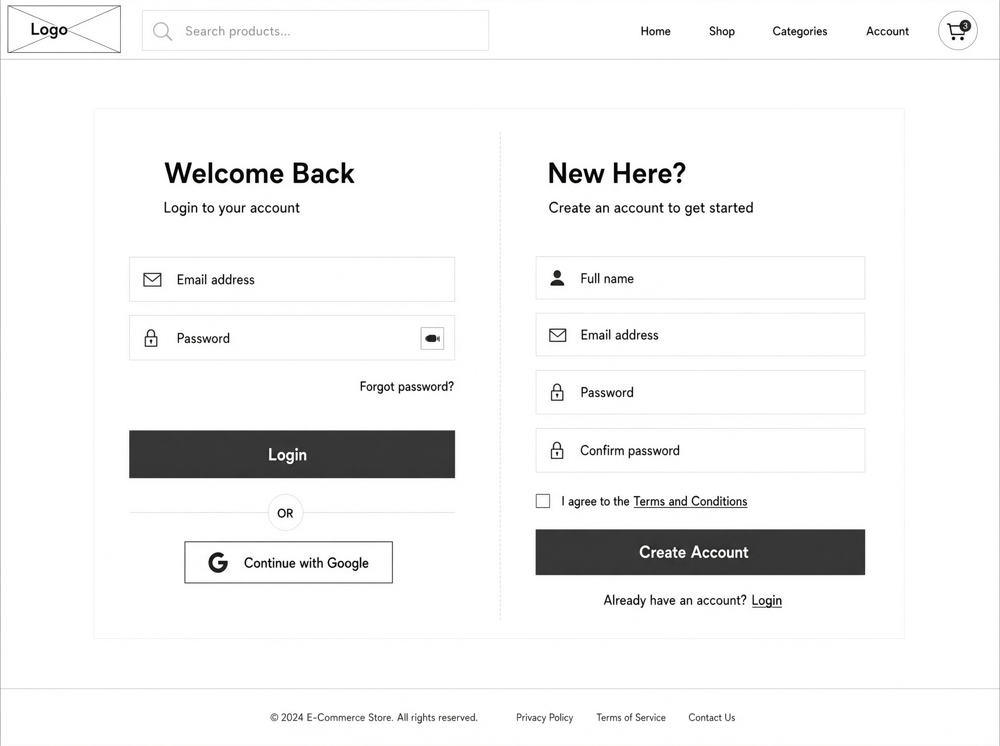
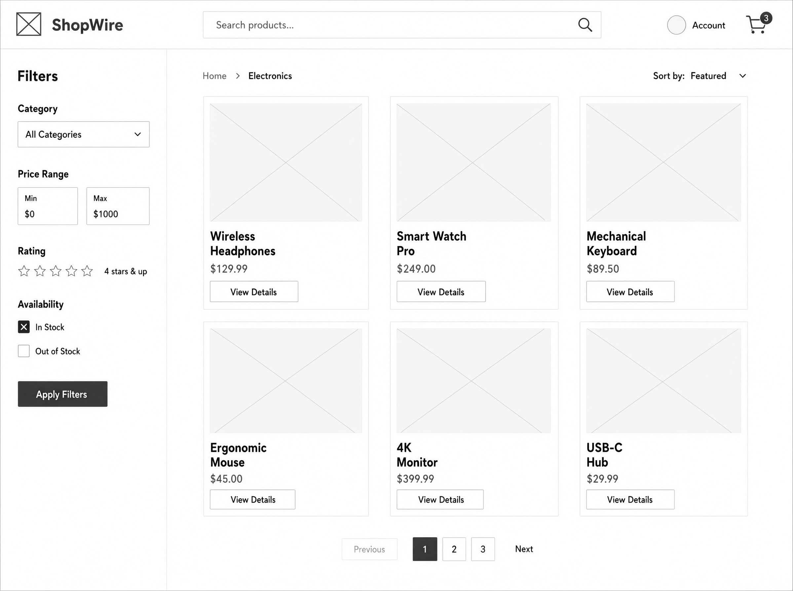
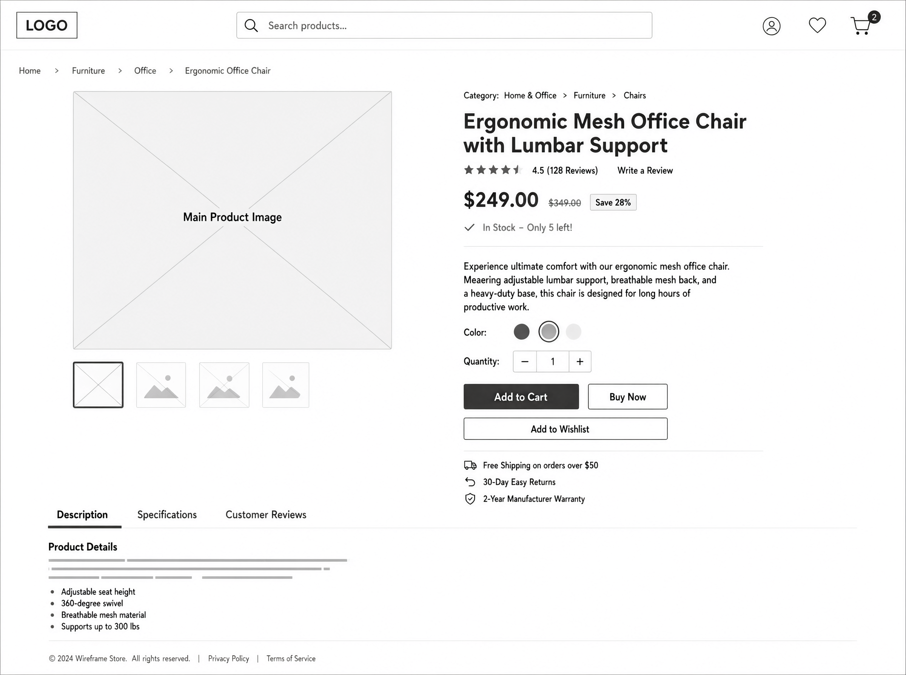
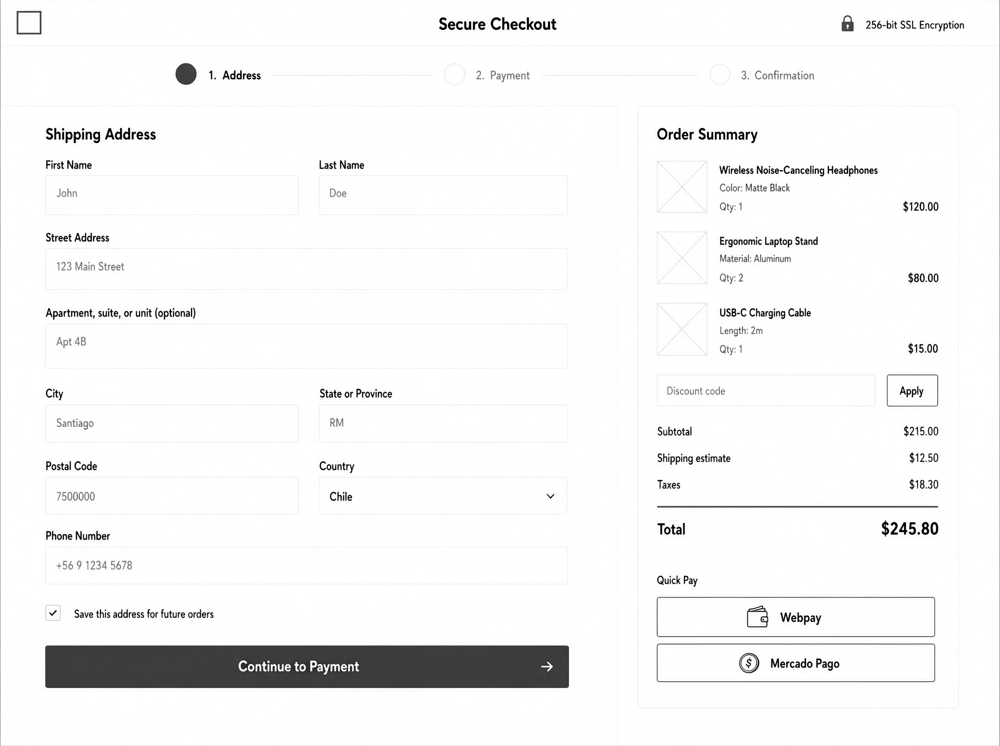
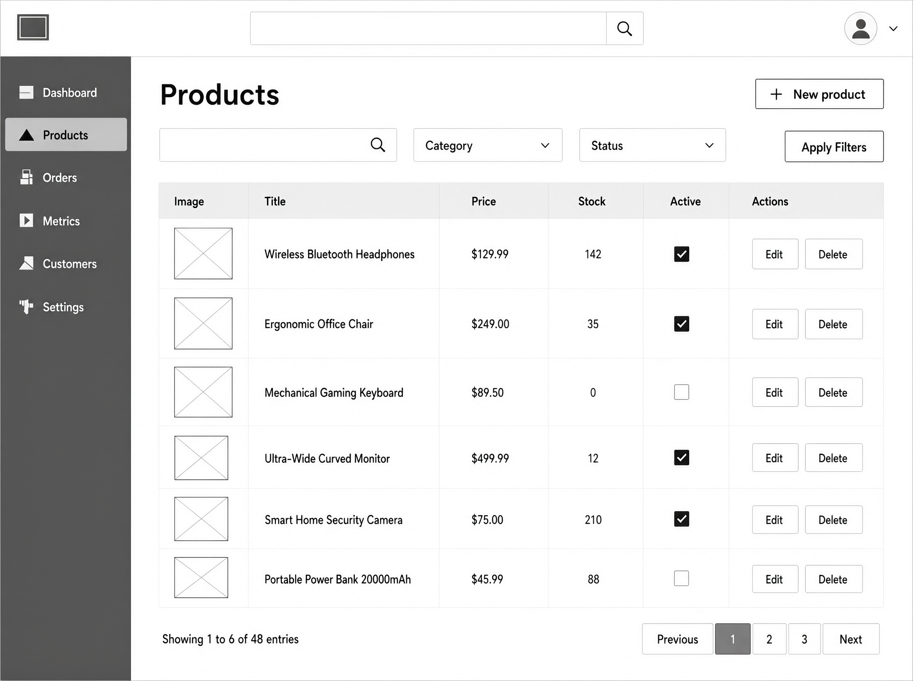
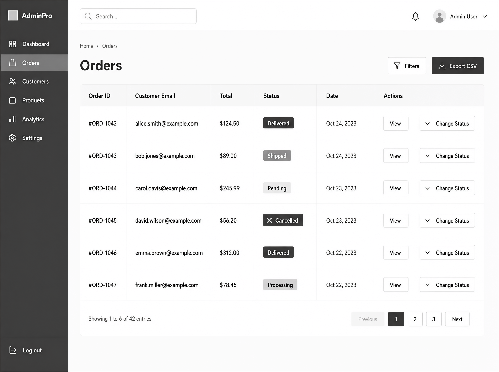

# UX-01 — Wireframes Básicos (Storefront & Admin)

Documento de referencia visual del e-commerce. Los wireframes son de **baja fidelidad** (estructura, no estilo final) y guían la implementación con Tailwind CSS en `apps/web` (FE-01 en adelante).

---

## 1. Sistema de Diseño (guías Tailwind)

### Paleta de colores

| Uso               | Clase Tailwind                  | Nota                         |
| ----------------- | ------------------------------- | ---------------------------- |
| Fondo storefront  | `bg-white` / `bg-neutral-50`    | Vitrina clara                |
| Texto principal   | `text-neutral-900`              |                              |
| Acción primaria   | `bg-blue-600 hover:bg-blue-700` | "Agregar", "Pagar", "Entrar" |
| Acción secundaria | `border border-neutral-300`     | Botones outline              |
| Éxito             | `text-green-600`                | Confirmaciones               |
| Error             | `text-red-600`                  | Validaciones y errores       |
| Admin (sidebar)   | `bg-neutral-900 text-white`     | Diferencia el panel          |

### Tipografía

- Fuente sans por defecto (`font-sans`).
- Título de producto: `text-lg font-semibold`.
- Precio: `text-xl font-bold`.
- Texto secundario: `text-sm text-neutral-600`.

### Componentes base

- Botón: `rounded-md px-4 py-2`.
- Card: `rounded-lg border border-neutral-200 shadow-sm`.
- Input: `rounded-md border border-neutral-300 px-3 py-2`.

---

## 2. Storefront

### 2.1 Login / Registro (Sprint 1)

### 2.2 Home / Vitrina (Sprint 1-2)

### 2.3 Detalle de producto (Sprint 1-2)

### 2.4 Checkout (Sprint 2-3, preview)

---

## 3. Panel Admin

### 3.1 Productos (CRUD, Sprint 1)

### 3.2 Pedidos (Sprint 2-3, preview)

---

## 4. Mapeo de vistas por sprint

| Vista                 | Sprint | Tarea FE |
| --------------------- | ------ | -------- |
| Login / Registro      | 1      | FE-01    |
| Vitrina / Detalle     | 1-2    | FE-02    |
| Carrito lateral       | 2      | FE-02    |
| Checkout              | 2-3    | FE-03    |
| Admin productos       | 1      | FE-04    |
| Admin pedidos/métric. | 3-4    | FE-04    |
